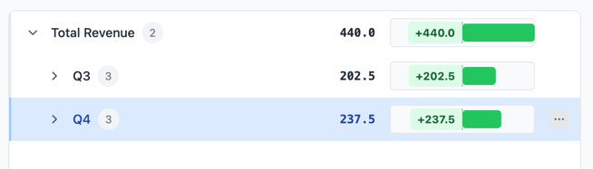
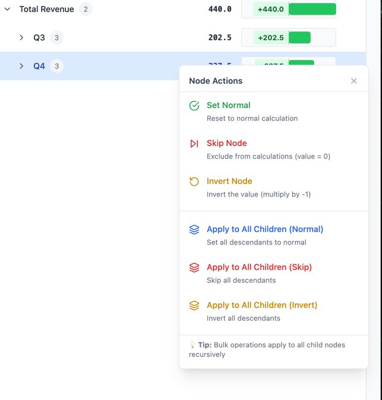

# Hierarchical Data Visualizer

A React-based tool for visualizing and manipulating large hierarchical datasets (10,000+ leaf nodes) with interactive controls, D3.js rendering, and real-time status editing.

## Features

- **Arbitrary-depth hierarchy:** Supports any level of nested data.
- **Performance:** Virtualized rendering and lazy loading for smooth interaction with large datasets (tested with 10,000+ leaf nodes).
- **Leaf node controls:** Invert or skip values for any leaf node
- **D3.js visualization:** Renders the data structure using D3.js (numbers + charts).
- **UI controls:** Context menu with options for basic font settings, coloring, and filtering.

## Getting Started

1. **Install dependencies**
    ```bash
    npm install
    ```
2. **Run in development**
    ```bash
    npm run dev
    ```
3. **Open** [https://h-structure.vercel.app/](https://h-structure.vercel.app/) in your browser.

## Usage

- Expand/collapse nodes to explore the hierarchy.
- Right-click a node to invert or skip its value.
- 
- 
- Use the context menu for bulk actions on subtrees (where supported).
- Filter or search for nodes using the UI controls.

## Extras

- Multiple themes (dark, light, colorful)
- Customizable layout (font size, node spacing..)
- Real-time calculations when status changes

---

